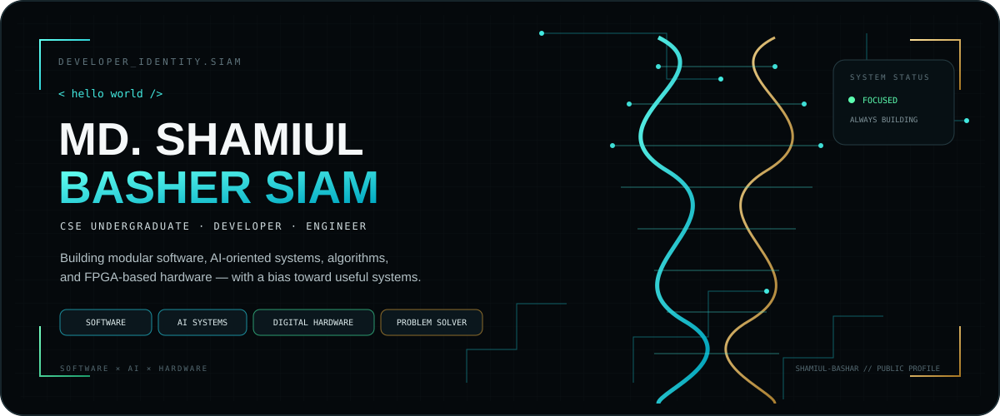
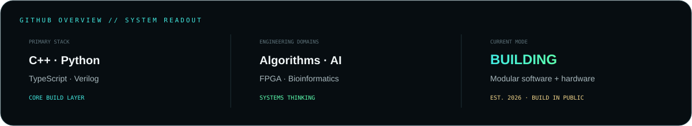
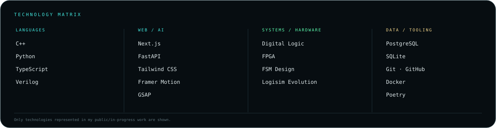
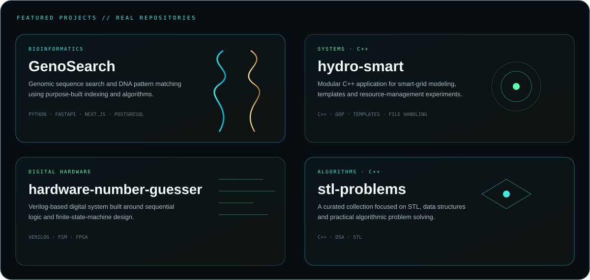
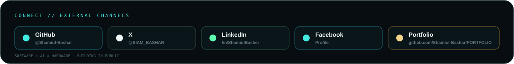

  
  
  
  

## `01` — ABOUT

I build at the intersection of **software, AI-oriented systems, algorithms, and digital hardware**.  
My work ranges from modular C++ applications and data structures to **FPGA / Verilog systems** and bioinformatics tooling.

## `02` — TECHNOLOGY MATRIX

## `03` — SELECTED WORK

  Selected from my public repositories · explore the full archive on <a href="https://github.com/Shamiul-Bashar?tab=repositories">GitHub</a>

## `04` — ENGINEERING INTERESTS

`DATA STRUCTURES`　 `ALGORITHMS`　 `AI SYSTEMS`　 `DIGITAL LOGIC`　 `FPGA`　 `BIOINFORMATICS`　 `SYSTEM DESIGN`

## `05` — GITHUB READOUT

## `06` — TROPHIES

## `07` — LET'S CONNECT

  <a href="https://github.com/Shamiul-Bashar">GitHub</a> ·
  <a href="https://x.com/SIAM_BASHAR">X</a> ·
  <a href="https://www.linkedin.com/in/ShamiulBasher/">LinkedIn</a> ·
  <a href="https://www.facebook.com/share/1VfwfReLdL/">Facebook</a> ·
  <a href="https://github.com/Shamiul-Bashar/PORTFOLIO">Portfolio Repository</a>

  BUILDING IN PUBLIC · SOFTWARE × AI × HARDWARE

